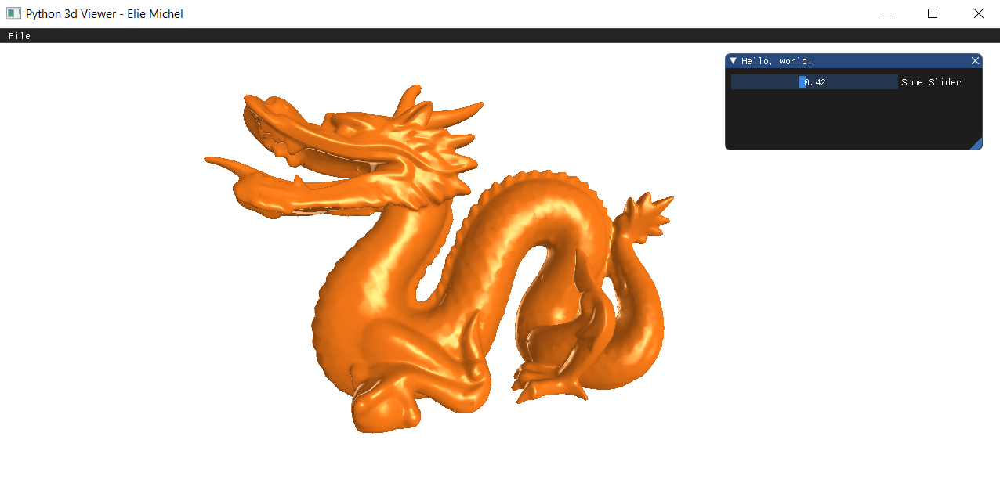

Python 3D Viewer
================

A simple starter Python code for experimenting 3D graphics using [glfw](https://github.com/FlorianRhiem/pyGLFW), [moderngl](https://moderngl.readthedocs.io) and [imgui](https://pyimgui.readthedocs.io).



The squeleton of an application using this template looks like:

```python
class MyApp(App):
    def init(self):
    	"""Load shaders, meshes, etc."""
        # ...

    def update(self, time, delta_time):
    	"""Update scene"""
        # ...

    def render(self):
    	"""Use modergl to draw 3d here"""
        # ...

    def ui(self):
        """Use the imgui module here to draw the UI"""
        # ...

    def on_key(self, key, scancode, action, mods):
    	"""React to user input"""
        # ...

    def on_mouse_move(self, x, y):
        # ...

    def on_mouse_button(self, button, action, mods):
        # ...

    def on_scroll(self, x, y):
        # ...

    def on_resize(self, width, height):
        # ...

app = MyApp(1280, 720, "My 3D application")
app.main_loop()
```

License
-------

```
Copyright (c) 2020 -- Élie Michel <elie.michel@exppad.com>

Permission is hereby granted, free of charge, to any person obtaining a copy
of this software and associated documentation files (the "Software"), to
deal in the Software without restriction, including without limitation the
rights to use, copy, modify, merge, publish, distribute, sublicense, and/or
sell copies of the Software, and to permit persons to whom the Software is
furnished to do so, subject to the following conditions:

The above copyright notice and this permission notice shall be included in
all copies or substantial portions of the Software.

The Software is provided "as is", without warranty of any kind, express or
implied, including but not limited to the warranties of merchantability,
fitness for a particular purpose and non-infringement. In no event shall the
authors or copyright holders be liable for any claim, damages or other
liability, whether in an action of contract, tort or otherwise, arising
from, out of or in connection with the software or the use or other dealings
in the Software.
```
